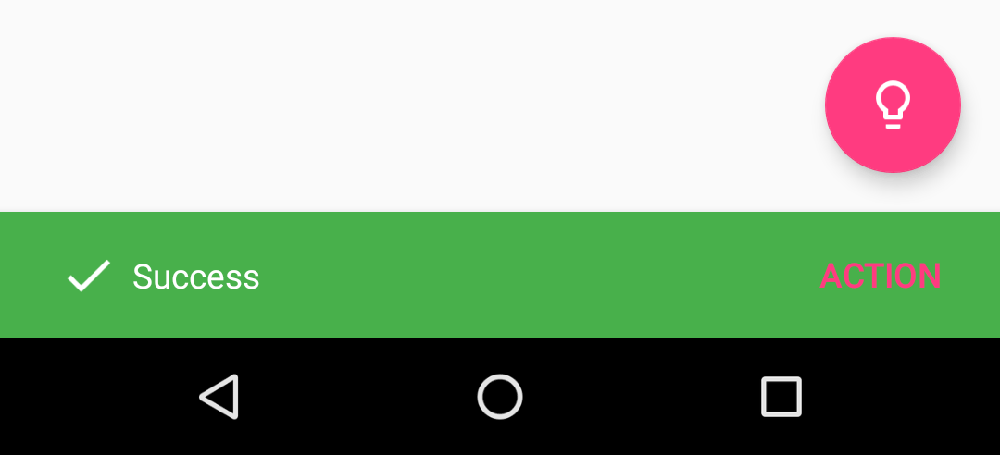
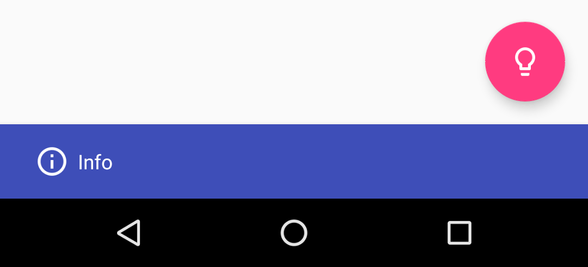
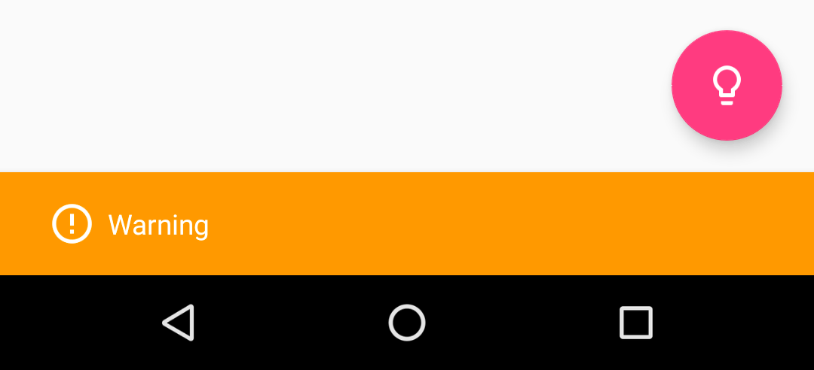
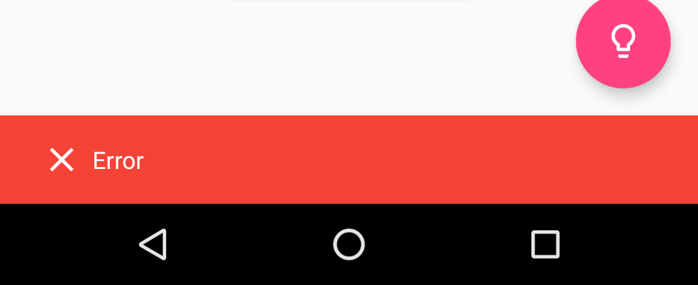
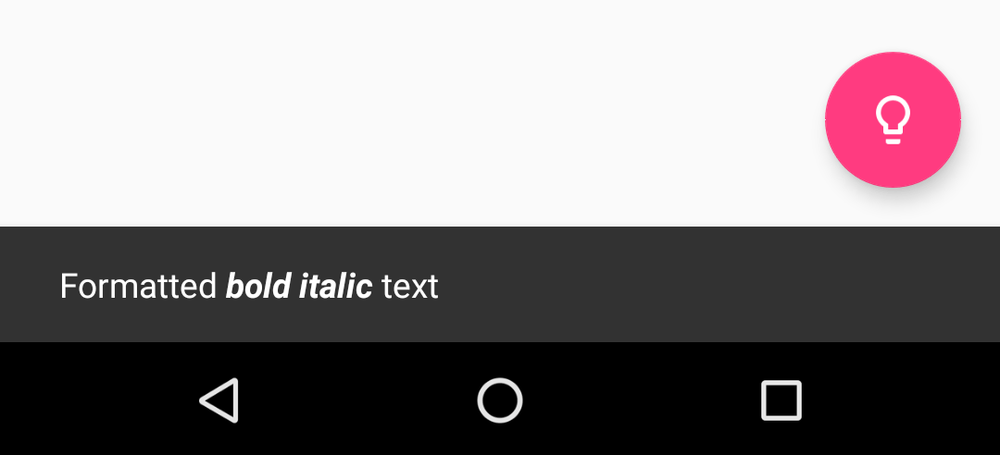
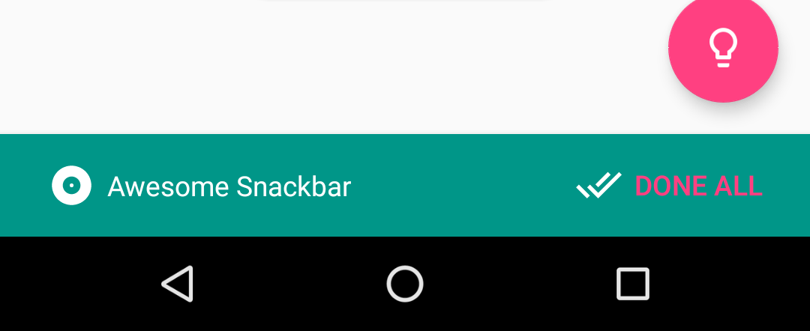

# Light
[](https://travis-ci.org/TonnyL/Light)

<div align="center">
	
</div>

The usual Snackbar, but elegant. Inspired by [Toasty](https://github.com/GrenderG/Toasty).

## Screenshots

<table>
	<tr>
		<td> <strong>Success</strong> </td>
		<td> <strong>Info</strong> </td>
		<td> <strong>Warning</strong> </td>
	</tr>
	<tr>
		<td>  </td>
		<td>  </td>
		<td>  </td>
	</tr>
	<tr>
		<td> <strong>Error</strong> </td>
		<td> <strong>Normal</strong> </td>
		<td> <strong>Custom</strong> </td>
	</tr>
	<tr>
		<td>  </td>
		<td>  </td>
		<td>  </td>
	</tr>
</table>

## Download

### Gradle

Add the code below to your **root** `build.gradle` file (`NOT` your module `build.gradle` file, check [here](./build.gradle/#L15-L19) for example).

```groovy
allprojects {
    repositories {
        jcenter()
    }
}
```

Add code below to your **module**'s `build.gradle` file:

```groovy
dependencies {
	// Other dependencies here.
	compile 'io.github.tonnyl:light:1.0.0'
}
```

### Maven

```xml
<dependency>
  <groupId>io.github.tonnyl</groupId>
  <artifactId>light</artifactId>
  <version>1.0.0</version>
  <type>pom</type>
</dependency>
```

## Usage

Each method always returns a `Snackbar` object, so you can customize the Snackbar much more. **DO NOT FORGET TO CALL THE `show()` METHOD!**

+ To display a success Snackbar:

```Java
Light.success(fab, "Success", Light.LENGTH_SHORT)
        .setAction("Action", new View.OnClickListener() {
            @Override
            public void onClick(View v) {
                // Do anything you want to do
                Toast.makeText(MainActivity.this, "Hello, Light!", Toast.LENGTH_SHORT).show();
            }
        })
        .show();

// or call

Light.make(fab, "Success", Light.TYPE_SUCCESS, Light.LENGTH_SHORT).show();
```

+ To display an info Snackbar:

```Java
Light.info(fab, "Info", Light.LENGTH_SHORT).show();

// or call
Light.make(fab, "Info", Light.TYPE_INFO, Light.LENGTH_SHORT).show();
```

+ To display a warning Snackbar:

```Java
Light.warning(fab, "Warning", Light.LENGTH_SHORT).show();

// or call
Light.make(fab, "Warning", Light.TYPE_WARNING, Light.LENGTH_SHORT).show();
```

+ To display an error Snackbar:

```java
Light.error(fab, "Error", Light.LENGTH_SHORT).show();

// or call
Light.make(fab, "Error", Light.TYPE_ERROR, Light.LENGTH_SHORT).show();
```

+ To display the usual Snackbar:

```Java
Light.normal(fab, "Normal", Light.LENGTH_SHORT).show();

// or call
Light.make(fab, "Normal", Light.TYPE_NORMAL, Light.LENGTH_SHORT).show();
```

+ You can also create your own Snackbar in custom-designed style:

```Java
Light.make(
        fab, // The view to find a parent from.
        "Awesome Snackbar", // The text to show.
        R.drawable.ic_album_white_24dp, // The left icon of text to show.
        R.color.color_cyan, // The background color of Snackbar.
        android.R.color.white, // The color of text to show.
        Light.LENGTH_INDEFINITE, // How long to display the message.
        R.drawable.ic_done_all_white_24dp, // The left icon of action text.
        R.color.colorAccent) // The color of action text.
        .setAction("Done all", new View.OnClickListener() {
            @Override
            public void onClick(View v) {
                // Do whatever you want to do.
                Toast.makeText(MainActivity.this, "Hello, Light!", Toast.LENGTH_SHORT).show();
            }
        })
        .show();
```

## Extra

[You can pass formatted text to Light!](./app/src/main/java/io/github/tonnyl/sample/MMainActivity.java/#L84-L91)

## Pull Request

Have some new ideas or find a bug? Do not hesitate to open an `issue` and make a `pull request`.

## License

```
Copyright 2017 lizhaotailang

Licensed under the Apache License, Version 2.0 (the "License");
you may not use this file except in compliance with the License.
You may obtain a copy of the License at

    http://www.apache.org/licenses/LICENSE-2.0

Unless required by applicable law or agreed to in writing, software
distributed under the License is distributed on an "AS IS" BASIS,
WITHOUT WARRANTIES OR CONDITIONS OF ANY KIND, either express or implied.
See the License for the specific language governing permissions and
limitations under the License.
```
